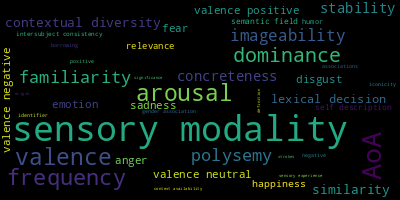

# Database of Cross-Linguistic Norms, Ratings, and Relations for Words and Concepts as CLDF dataset

## How to cite

If you use these data please cite
- the original source
  > Tjuka, Annika, Robert Forkel, and Johann-Mattis List. 2022. Linking Norms, Ratings, and Relations of Words and Concepts Across Multiple Language Varieties. Behavior Research Methods 54. 864–884. DOI: 10.3758/s13428-021-01650-1
- the derived dataset using the DOI of the [particular released version](../../releases/) you were using

## Description

This dataset is licensed under a CC-BY-4.0 license

Available online at https://norare.clld.org

This CLDF dataset provides the data of the corresponding release of
[concepticon/norare-data](https://github.com/concepticon/norare-data) as CLDF Wordlist.
The latest release of this dataset can be browsed in a clld web application at 
[https://norare.clld.org](https://norare.clld.org).
Information on how to use the data is available at [doc](doc/).

## CLDF Datasets

The following CLDF datasets are available in [cldf](cldf):

- CLDF [Wordlist](https://github.com/cldf/cldf/tree/master/modules/Wordlist) at [cldf/Wordlist-metadata.json](cldf/Wordlist-metadata.json)