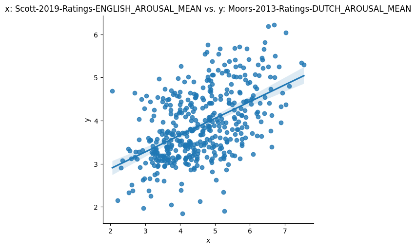

# Using NoRaRe data from the CLDF dataset

[CLDF](https://cldf.clld.org) is a package format for linguistic data, bundling a set of tables as CSV files
with JSON metadata, describing - among other things - relations between these tables.

First, familiarize yourself with the data model by looking through [cldf/README.md](../cldf/README.md).
In the following, we will explore the data while reproducing usage of the data in publications about
NoRaRe.


## Reading the CSV tables

Let's start with recreating the wordcloud in the 
[press release](https://www.eva.mpg.de/press/news/article/norare-a-multilingual-database-of-word-and-concept-properties/)
accompanying the [NoRaRe paper](https://doi.org/10.3758/s13428-021-01650-1). This wordcloud depicts the tags used to describe [NoRaRe variables](../cldf/README.md#table-variablescsv)
and their frequency.

The CSV files in a CLDF dataset can readily be inspected using the tools available in the
[Unix Shell](https://swcarpentry.github.io/shell-novice/), ideally combined with more specialized tools like the ones
in [csvkit](https://csvkit.readthedocs.io/en/latest/). So the data we want to put in the wordcloud looks as follows:
```shell
$ csvcut -c Result cldf/variables.csv | sort | uniq -c | sort -nr | head -n 10
    143 sensory modality
     90 AoA
     55 frequency
     49 valence
     49 arousal
     36 dominance
     30 polysemy
     27 familiarity
     19 stability
     16 imageability
```

Using the [wordcloud package for Python](https://pypi.org/project/wordcloud/) and the [pycldf](https://github.com/cldf/pycldf) package
to read the data, we can recreate the image with the following code:
```python
from collections import Counter
from wordcloud import WordCloud
from pycldf import Dataset

norare = Dataset.from_metadata('cldf/Wordlist-metadata.json')
wc = WordCloud().generate_from_frequencies(Counter([r['Result'] for r in norare['variables.csv']]))
img = wc.to_image()
img.show()
```


## Reading data from multiple tables

The NoRaRe dataset - like most other CLDF datasets - contains multiple, related tables. While it is possible
to join data from these tables by reading the CSV and assembling related rows using any programming platform
(like Python, R, or just the Unix Shell), we can also use a platform custom-built for this kind of data.
CLDF contains all the
information necessary to load a dataset into a relational database - and a command from the [pycldf](https://github.com/cldf/pycldf)
package can turn any CLDF dataset into a [SQLite database](https://pycldf.readthedocs.io/en/latest/db.html), which can be queried
more comfortably using SQL.
```shell
$ cldf createdb cldf/Wordlist-metadata.json norare.sqlite
INFO    <cldf:v1.0:Wordlist at cldf> loaded in norare.sqlite
```

Now we can easily retrieve data, e.g. listing word frequencies as reported in NoRaRe datasets for words expressing
the same concept (according to [Concepticon](https://concepticon.clld.org)) as was done
for [figure 3](https://link.springer.com/article/10.3758/s13428-021-01650-1/figures/3)
of the paper
[Linking norms, ratings, and relations of words and concepts across multiple language varieties](https://doi.org/10.3758/s13428-021-01650-1).

Running [the query](query_3.sql)
```sql
SELECT c.cldf_id as cid, c.cldf_name, f.cldf_languageReference, f.cldf_form, var.cldf_id, v.value FROM
  `norare.csv` as v,
  `variables.csv` as var,
  FormTable as f,
  ParameterTable as c
WHERE
  v.cldf_formReference = f.cldf_id
  AND v.Variable_ID = var.cldf_id
  AND f.cldf_parameterReference = c.cldf_id
  AND c.cldf_id IN ('420', '906', '1803', '344', '670')
  AND var.category = 'norms'
  AND var.cldf_id LIKE '%FREQUENCY_LOG'
  AND f.cldf_languageReference IN ('eng', 'deu')
ORDER BY cid
```
as
```shell
sqlite3 norare.sqlite -header < doc/query_3.sql 
```
results in

cid|cldf_name|cldf_languageReference|cldf_form|cldf_id|Value
--- | --- | --- | --- | --- | ---
1803|WOOD|eng|wood|Brysbaert-2009-Frequency-ENGLISH_FREQUENCY_LOG|3.139249217571607
1803|WOOD|deu|Holz|Brysbaert-2011-Frequency-GERMAN_FREQUENCY_LOG|2.742
1803|WOOD|eng|wood|VanHeuven-2014-Frequency-ENGLISH_FREQUENCY_LOG|4.779882859349039
344|TREE TRUNK|eng|trunk|Brysbaert-2009-Frequency-ENGLISH_FREQUENCY_LOG|3.004751155591001
344|TREE TRUNK|deu|Stamm|Brysbaert-2011-Frequency-GERMAN_FREQUENCY_LOG|2.428
420|FOREST|eng|forest|Brysbaert-2009-Frequency-ENGLISH_FREQUENCY_LOG|2.984077033902831
420|FOREST|deu|Wald|Brysbaert-2011-Frequency-GERMAN_FREQUENCY_LOG|3.094
420|FOREST|eng|forest|VanHeuven-2014-Frequency-ENGLISH_FREQUENCY_LOG|4.668355065254214
670|ROOT|eng|root|Brysbaert-2009-Frequency-ENGLISH_FREQUENCY_LOG|2.7283537820212285
670|ROOT|deu|Wurzel|Brysbaert-2011-Frequency-GERMAN_FREQUENCY_LOG|1.833
670|ROOT|eng|root|VanHeuven-2014-Frequency-ENGLISH_FREQUENCY_LOG|4.133803176648084
906|TREE|eng|tree|Brysbaert-2009-Frequency-ENGLISH_FREQUENCY_LOG|3.520614521878236
906|TREE|deu|Baum|Brysbaert-2011-Frequency-GERMAN_FREQUENCY_LOG|3.01
906|TREE|eng|tree|VanHeuven-2014-Frequency-ENGLISH_FREQUENCY_LOG|4.952044475316525


Note that a typo in the paper specified the Concepticon ID of `FOREST` as 402 insteaf of 420.

Having determined that comparable variables, measuring similar phenomena in different languages,
are available in NoRaRe, we might want to compute correlations, as was done in the blog post
[Comparing NoRaRe data sets: Calculation of correlations and creation of plots in R](https://calc.hypotheses.org/3109).

Again, an SQL statement can be used to assemble the data.
To retrieve the data for the variable `Scott-2019-Ratings-ENGLISH_AROUSAL_MEAN` and variable `Moors-2013-Ratings-DUTCH_AROUSAL_MEAN`
we run
```sql
SELECT
  cid,
  AVG(CASE WHEN vid = 'Scott-2019-Ratings-ENGLISH_AROUSAL_MEAN' THEN CAST(v AS float) ELSE null END) AS x,
  AVG(CASE WHEN vid = 'Moors-2013-Ratings-DUTCH_AROUSAL_MEAN' THEN CAST(v AS float) ELSE null END) AS y
FROM (
    SELECT
        f.cldf_parameterReference as cid, v.Value as v, v.Variable_ID as vid
    FROM
        FormTable as f, `norare.csv` as v
    WHERE
        (v.Variable_ID = 'Scott-2019-Ratings-ENGLISH_AROUSAL_MEAN' OR v.Variable_ID = 'Moors-2013-Ratings-DUTCH_AROUSAL_MEAN')
        AND v.cldf_formReference = f.cldf_id
    ) AS vals
GROUP BY cid
HAVING x > 0 AND y > 0
```

Using the [pandas](https://pypi.org/project/pandas/) and [seaborn](https://pypi.org/project/seaborn/) packages for Python,
we can plot the correlation using code like
```python
import sqlite3
from PIL import Image
import pandas as pd
import seaborn as sns

SQL = """SELECT ..."""
plot = sns.lmplot(
    x='x',
    y='y',
    data=pd.read_sql(SQL, sqlite3.connect('norare.sqlite')))
    plot.set(title='x: Scott-2019-Ratings-ENGLISH_AROUSAL_MEAN vs. y: Moors-2013-Ratings-DUTCH_AROUSAL_MEAN')
    plot.fig.savefig('corr.png', bbox_inches='tight')
    Image.open('corr.png').show()
```



Note that we had to use the `AVG` aggregate function in the above query to accommodate the case of multiple values for
the same variable being assigned to words which are mapped to the same concept.
While this is not the case for the majority of variables, it still happens for 240 variables, as can be inspected running
the following query:
```sql
SELECT
    COUNT(DISTINCT variable_id) 
FROM (
    SELECT
        f.cldf_parameterReference, uv.variable_id, COUNT(uv.cldf_id) AS c
    FROM
        formtable AS f, `norare.csv` AS uv
    WHERE
        uv.cldf_formReference = f.cldf_id AND f.cldf_parameterReference != 0
    GROUP BY
        uv.Variable_ID, f.cldf_parameterReference
    HAVING
        c > 1
    ORDER BY c DESC
) AS s;
```


## Datatypes

When assembling the data to look at the correlation above, we explicitly converted the values in the `Value` column of
`norare.csv` to numbers, using the SQL function call `CAST(v AS float)`. NoRaRe variables provide norms, ratings and relations
in a variety of datatypes. While most variables have numeric values, some are categorical (i.e. have strings from a controlled
vocabulary as values), and a few aggregate raw measurements into composite objects. Since the NoRaRe data provides all
these values in a single column of the `norare.csv` table, these values are given as string representations. So values in
`norare.csv` may look like `0.123`, but also like `ANT` or even `{"platt-wellig":{"ANT":7.5}}` - which may interfere with
datatype inference mechanisms in tools like the Python package `pandas` or CSV readers for the R language.

Since each CLDF dataset conforms to the [CSVW specification](https://w3c.github.io/csvw/syntax/), NoRaRe uses
[CSVW datatype specifications](https://w3c.github.io/csvw/syntax/#datatypes) to explicitly state the datatype of the
values for a variable. Thus, the `Datatype` column of the `variables.csv` table contains a [CSVW column specification](https://w3c.github.io/csvw/syntax/#columns)
in JSON format, including a `datatype` property which can be used to interpret the values. (Note that the `datatype` property
alone would not suffice because NoRaRe variables may have lists of atomic types as values, which is signaled by a
`separator` property in the column specification.)

In practice, this means that one should always keep track of which variable a set of values belongs to and and inspect
the associated datatype to interpret the data correctly. Using a [CSVW-aware tools](https://csvw.org) like the Python package `csvw`
reading the values for a variable could look as follows:
```python
>>> from csvw.dsv import reader
>>> from csvw.metadata import Column
>>> import json
>>> datatypes = {r['ID']: r['Datatype'] for r in reader('cldf/variables.csv', dicts=True)}
>>> col = datatypes['Alonso-2015-AoA-SPANISH_AOA_MEAN']
>>> col
'{"datatype": {"base": "decimal", "minimum": "1", "maximum": "11"}, "name": "SPANISH_AOA_MEAN", "titles": "averageAoA"}'
>>> col = Column.fromvalue(json.loads(datatypes['Alonso-2015-AoA-SPANISH_AOA_MEAN']))
>>> col.read('3.4')
Decimal('3.4')
>>> col.read('30')
...
ValueError: value must be <= 11
```

Or for list-valued variables:
```python
>>> col = Column.fromvalue(json.loads(datatypes['Baroni-2011-200-COHYPONYMY']))
>>> col.separator
', '
>>> col.read('word1, word2, word3')
['word1', 'word2', 'word3']
```
